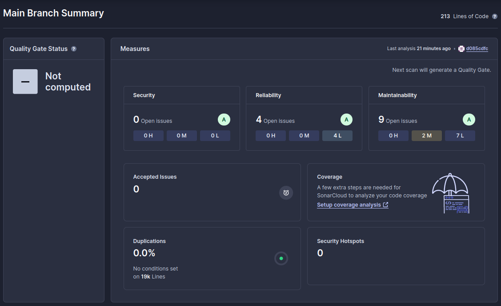
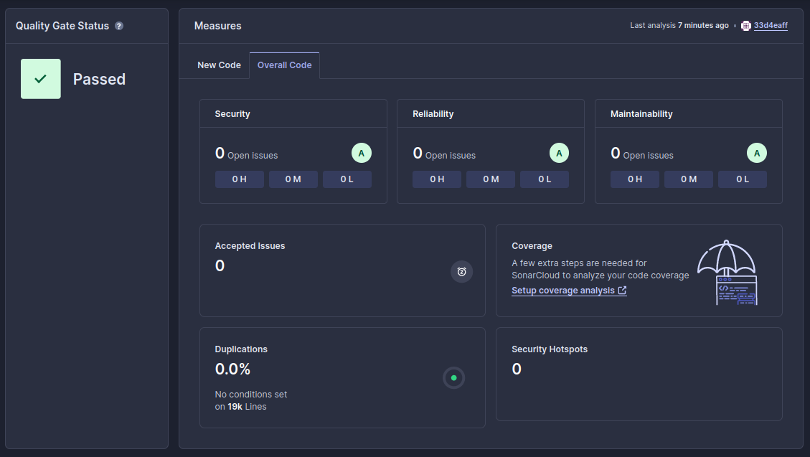

# Zadanie 6

[](https://sonarcloud.io/summary/new_code?id=marekostafin_po-zadanie6)
[](https://sonarcloud.io/summary/new_code?id=marekostafin_po-zadanie6)

### Na 3.0

Pliki zadania 6 umieściłem w osobnym repozytorium, ponieważ w ten sposób łatwiej było mi skonfigurować hook'a.
Pliki znajdują się tutaj:

https://github.com/marekostafin/po-zadanie6

Hook, który dodałem ma następujący kod.
```
#!/bin/bash

STAGED_FILES=$(git diff --cached --name-only --diff-filter=ACM | grep ".jsx\{0,1\}$")

PASS=true

for FILE in $STAGED_FILES
do
  npx eslint "$FILE"

  if [[ "$?" == 0 ]]; then
    echo "ESLint Passed: $FILE"
  else
    echo "ESLint Failed: $FILE"
    PASS=false
  fi
done

echo "\nJavascript validation completed!\n"

if ! $PASS; then
    echo "ESLint found errors. Please fix them before committing."
    exit 1
fi
```
Nagranie ilustrujące jego działanie znajduje się w katalogu z niniejszym README.

### Na 3.5



Po przeskanowaniu repozytorium za pomocą SonarCloud'a, okazało się, że aplikacja nie ma żadnych bugów. 
Podpunkt na 3.5 jest więc spełniony - przechodzę dalej.

### Na 4.0
Na powyższym zrzucie ekranu widać, że w kodzie jest 9 zapaszków.
Po poprawieniu ich, analiza wygląda następująco:



Czyli udało się zredukować zapaszki do zera.

### Na 4.5
Na powyższym zrzucie ekranu widać, że nie ma żadnych podatności ani błędów bezpieczeństwa.

### Na 5.0
Jak wyżej.